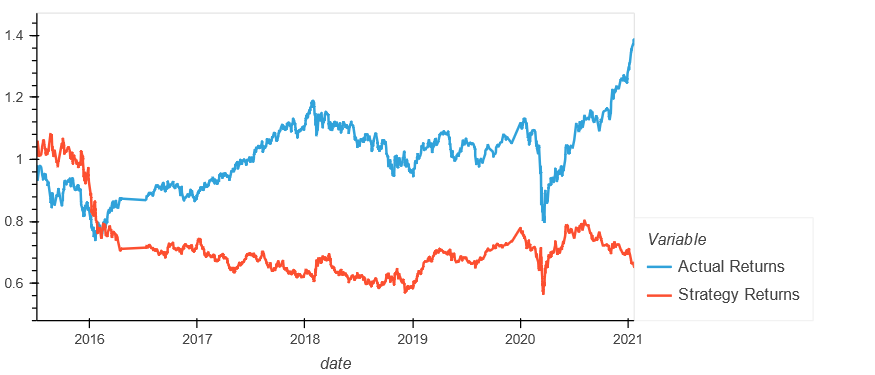
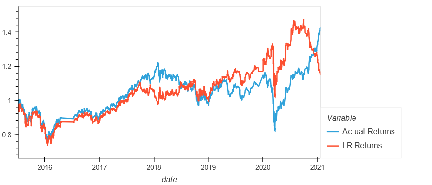
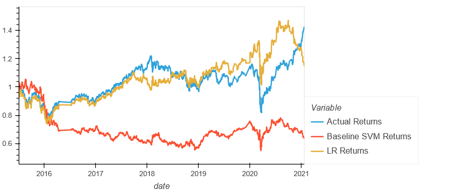
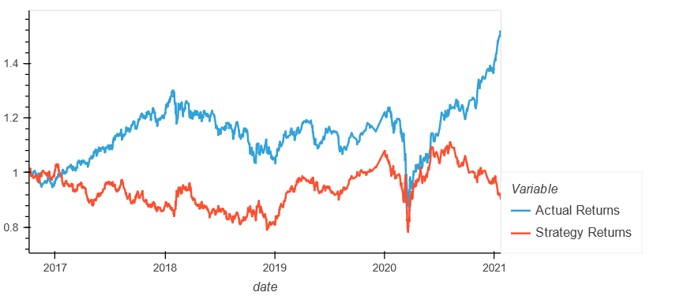
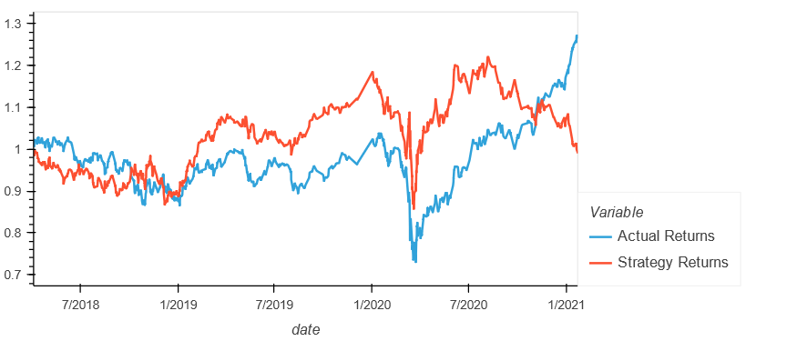
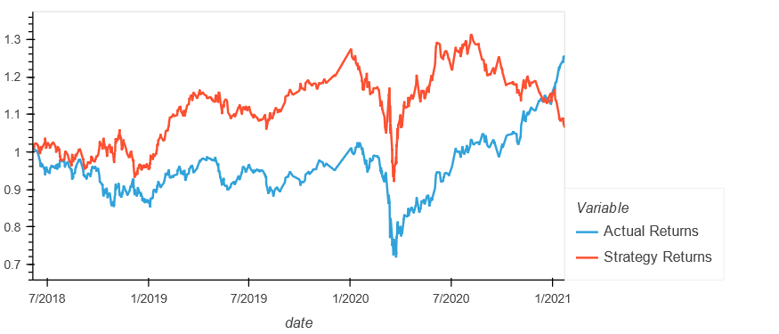
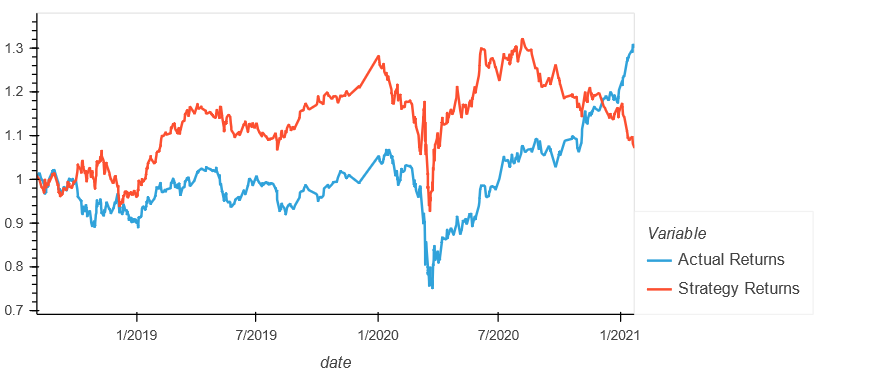
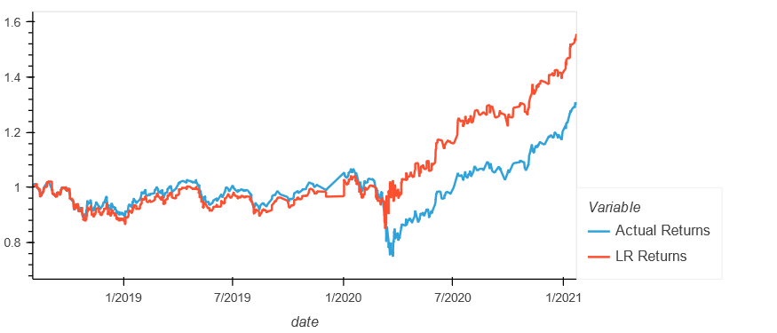
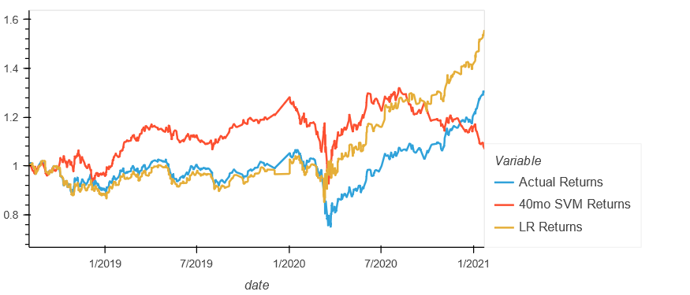

# Machine Learning Trading Bot
---
## Part 1 Initializing Baseline Bot
For this project I was able to use Supoort Vector Machine (SVM) and Logistic Regression (LR) models to train my machine learning bot on Simple Moving Average (SMA) of closing price data. Here are my initial results.
* This plot shows the actual returns compared to the baseline machine learning model, Support Vector Machine. The SMA short window was defaulted to 4 days, with a long window of 100 days. The training period was initally set to 3 months. As you can see, this is not a desirabe result, with strategy returns being well below actual returns. 

* Out of curiousity I ran the logisitic regression model on this baseline bot aswell, and while this model did seem to perform a little better, I don't like how it seems to be trending down toward the end of the testing data timeframe, while the actual returns are trending up. It does not look good for the future. 

* Here is a graph of both baseline models compared to actual returns. 

---
## Part 2 Adjusting Bot Parameters
Here I began with changing the training timeframe on the SVM model, and noticed that the longer I made the training timeframe, the better my results were. 
* Here is 18 months training on the SVM model. 

* Here is 3 years training on the SVM model. 

Next I tried adjusting the rolling window timeframes. I changed the short and long window many times, but finally settled on 7-day short window and 90-day long window for the rolling averages.
* Here is a plot showing the same 3 year training SVM model but with 7/90 SMA windows. 

Finally I combined different training timeframes and rolling windows, and settled on a 40 month training timeframe with the 7-day short window and 90-day long window for the rolling averages.
* Here is the final SVM model I created. Overall the returns here are much better than the baseline SVM model. However, the returns from this model are similar to the baseline LR model in that it seems to be trending down toward the end of the testing data timeframe, while the actual returns are trending up.

---
## Part 3 Using a New Machine Learning Model
I chose to use a logistic regression model as my second linear model option, since it is also very good with binary problems. As I showed earlier, I ran the Logistic Regression model on the baseline parameters just to be able to see it also improve with changed parameters. Once I had adjusted the parameters with the SVM model to their best outcome, I reran the LR model with the same dataset, with a rolling window of 7-day short and 90-day long and a training set of 40 months. 
* This gave much improved returns in the LR model. 

* Here are both the final SVM and final LR model returns plotted comparative to the actual returns. 

---
## Conclusion
I would definitely keep the Logistic Regression model over the SVM model as it seems to yield better returns. Also, as the close price seems to have a long rise/fall cycle, I would keep the training dataset to a minimum of 36mo/3y in order to give the bot sufficient market data get a good idea of the market volatility trends. My final LR model bot had a near perfect recall score for a positive result(buy) of 0.95, meaning that this bot is very reliable to indicate when to buy the stock. However, it had a very low recall score for -1(sell) and therefore might still need further testing and improvement. Precision for buy and sell were 0.56 and 0.55 respectively, which could also use some improvement before being utilitized in the real world. 